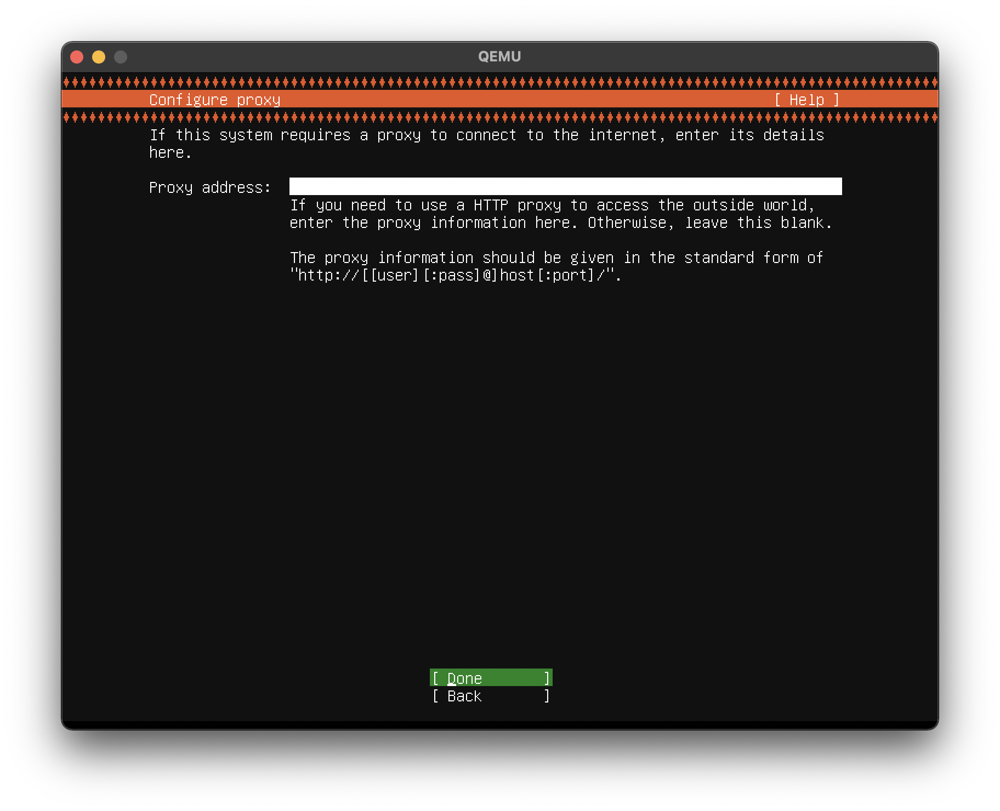

# Setup docker environment with QEMU directly on Mac Apple Silicon (Mac M1)

This project contains instruction and scripts used to setup docker environment with QEMU directly on Mac Apple Silicon.

After setup, you can use docker on Mac without Docker Desktop.

``` text
┌────────────────────┐     ┌───────────────────┐
│   QEMU Instance    │     │   Mac M1 Host     │
│   Ubuntu Server    │     │                   │
│                    │     │                   │
│              auto port forward               │
│   ssh server◄──────┬─────┬───ssh client      │
│                    │     │                   │
│ ┌►dockerd          │     │                   │
│ │              remote invoke                 │
│ └─docker◄───────────────────-docker          │
│   docker-compose◄──┼─────┼──-docker-compose  │
│                    │     │                   │
│                    │     │                   │
│                    │     │                   │
└────────────────────┘     └───────────────────┘
```

## What's different with other projects

### Lima

[Lima](https://github.com/lima-vm/lima) is a great project which provides super easy setup for qemu + linux + sshfs + containerd + docker compatiable command, but the file sharing protocol sshfs (fuse) is a troublemaker ([#231](https://github.com/lima-vm/lima/issues/231)), this setup will use qemu builtin in kernel samba protocol to share folder which give you more control and stability. Other advantage is this project will forward docker and docker-compose command to the real docker client inside qemu instance, which provides full compatibility for docker commands, Lima's docker compatiable command (lima nerdctl) is good but still lacking some function such as `docker system`, `docker compose exec` and `docker compose ps`.

### MiniKube

[MiniKube](https://github.com/kubernetes/minikube) is working well on Mac Intel but it doesn't support Mac Apple Silicon without Docker Desktop, check the source code [here](https://github.com/kubernetes/minikube/blob/master/pkg/minikube/driver/driver_darwin.go)

### UTM

[UTM](https://github.com/utmapp/UTM) provides a good gui for setup qemu machine, ~~but there is a [ultra bug](https://github.com/utmapp/UTM/issues/3094) which breaks networking if you enable full graphics, and if you disable full graphics with UTM you can't use it's file sharing protocol (which based on SPICE WebDAV)~~, they found a solution for the network unavailable bug, see [this link](https://mac.getutm.app/gallery/ubuntu-20-04#networking-is-unavailable-after-switching-between-console-only-and-full-graphics-modes), for now UTM should able to setup a Linux virtual machine with port forward and file sharing support, you could use UTM instead of this repository if you are familiar with Linux CLI.

## Requirement

This project required following conditions:

- macOS >= 12.4.0 (Monterey)
- qemu >= 7.0.0

## Preparation

Before setup the qemu environment, you need to uninstall Docker Desktop and install qemu from homebrew.

Before uninstall Docker Desktop, you may want to stop and remove all containers and images.

``` text
docker ps -q | xargs docker rm -f
docker ps
docker images -q | xargs docker rmi
docker system prune
```

Then exit Desktop Desktop from the icon on the top menu, and execute the script for removal, it will delete Docker Desktop from Applications and cleanup it's files:

``` text
sh remove_docker_desktop.sh
```

The next step is install qemu and samba from Homebrew, you need to [install Homebrew](https://brew.sh) first:

``` text
brew install lixiljp/saml2aws/qemu
brew install lixiljp/saml2aws/samba
```

Now you're ready to create and configure the qemu instance.

## Create QEMU Instance

First, download ubuntu server from the [offical download page](https://ubuntu.com/download/server/arm), and save the iso file to `Downloads` folder, you should download the LTS version (22.04/24.04 is tested).

Second, edit `setup.sh` and check the parameters on the top of the script, usually you don't have to modify them.

Now you can run this command to create qemu instance, you will need to install the system yourself and prepare ssh login before continue.

``` text
sh setup.sh create
```

Here is the instruction for install ubuntu server:

Choose `Install Ubuntu Server`.


Usually you will select `English`, because mostly you won't find any useful information when you search localized error message on the web.


Choose the keyboard layout you used.


Keep `Ubuntu Server` selected and press `Done`.


Press `Done`.


Press `Done` unless you network environment require proxy.



Press `Done`.


Unselect `Set up this disk as an LVM group` (space key) because it will only use half the disk by default.


Press `Done`.


Press `Continue`.


Enter the username and the password, the password only use to copy public key and it should be removed after public key login works.

Please make sure the username matched `SSH_USERNAME` in `startup.sh`.


Select `Install OpenSSH server` and press `Done`.


Press `Done`, don't install docker here.


Press `Reboot Now` after installation completed.


Close qemu window when you see the boot screen, now you have created the qemu instance.

## Setup SSH Login

Before continue to configure, you need to setup ssh login, `sh startup.sh create` should give you the instruction like:

``` text
# start qemu instance and port forwader
sh ~/.qemu/ubuntu/startup.sh

# generate ssh key, if you already have one please skip
ssh-keygen

# copy ssh public key to qemu instance, you will need to enter the password
ssh-copy-id -p 2200 ubuntu@127.0.0.1

# remove the password
ssh -p 2200 ubuntu@127.0.0.1 -t 'sudo passwd -d ubuntu'
```

If you see `read: Connection reset by peer` when execute `ssh-copy-id`, it's maybe because the server side ssh key is not generated, you need to login into the qemu instance and run following command:

``` text
sudo ssh-keygen -A
sudo systemctl restart ssh
```


Once you can connect the qemu instance with ssh, you can continue to the configure step.

## Configure QEMU Instance

This is the final step and it will make docker and docker-compose command available on the host.

Run this command to configure qemu instance, it will mount share folder, install docker and create docker command on the host:

``` text
sh setup.sh configure
```

If configure completed successfully, you can use docker and docker-compose command on the host now:

``` text
docker --version
docker-compose --version
docker ps
```

You will find an application name `Ubuntu` from Applications, click to to start qemu instance next time, you can also add this application to Login Items so it can be automatically started after login.

## Memo

### Connect to qemu instance via ssh

Here is the command by default (if you not changed the port number):

``` text
ssh -p 2200 ubuntu@127.0.0.1
```

### Port forwading

QEMU's bulit-in port forwarding will reject connection if connect too often, and it can't be changed while instance running. This setup provide a automatic port forwader that will detect listening ports and forward them to host automatically. You can check `~/.qemu/ubuntu/port_forward.log` to find out which ports are forwarded.

### Running x86 image

Running x86 image is possible (docker will use qemu-user-static), but some image are not compatiable because qemu-user-static doesn't support multi threading, for example, `mailcatcher` only provides `linux/amd64` on docker hub and it can't be run directly on this setup. But you can build `mailcatcher` image with aarch64 yourself, for example:

``` text
git clone https://github.com/sj26/mailcatcher
cd mailcatcher
docker build -t schickling/mailcatcher:latest
```

### Share folder

By default, the share folder path is `/Users/YourUsername`, the qemu instance will use exactly same path to ensure docker and docker-compose can read files without path mapping, but that also mean docker and docker-compose can't access files outside of `/Users/YourUsername`, for example, if you checkout a repository to `/tmp` and trying to use docker inside `/tmp/RepositoryName`, it won't work.

Share `/Users/YourUsername` to the qemu instance maybe "insecure" if you want to run untrusted application inside it, you can modify the path in `~/.qemu/ubuntu/startup.sh` to something like `/Users/YourUsername/Projects`, you will also need to modify `/etc/fstab` inside the qemu instance.

Samba doesn't support symlink, if you use `npm install` under share folder it will fail, you can pass `--no-bin-links` to npm install, or you can use volume for `node_modules` (recommended). File locking also won't work, if you want the application use a presistent sqlite db, you need to use volume to store the sqlite db file.

### File change notification

File change notification does not work for share folder, if you want your application reload automatically when file changed inside share folder, you need to enable pooling support, for example:

- nodemon: use `nodemon -L app.js`
- nuxtjs: set `watchers` property in `nuxt.config.js`, see [here](https://nuxtjs.org/docs/configuration-glossary/configuration-watchers) and [here](https://github.com/paulmillr/chokidar#api)
- flask: pooling is enabled by default

### Invalid accelerator hvf issue

If you saw `invalid accelerator hvf` error, it may due to you installed x86 version of qemu. Check `which qemu-system-aarch64` output, it should point to `/opt/homebrew/bin/qemu-system-aarch64`, if it's under `/usr/local/bin` then you have x86 version installed. To fix this issue you need to:

- Uninstall qemu: `brew uninstall qemu`
- Uninstall homebrew x86: `/bin/bash -c "$(curl -fsSL https://raw.githubusercontent.com/Homebrew/install/HEAD/uninstall.sh)"`
- Uncheck `Open using rosetta` for `Terminal` application
- Quit and run `Terminal` again, ensure it's under arm64 mode: `uname -m`
- Install homebrew arm64: `/bin/bash -c "$(curl -fsSL https://raw.githubusercontent.com/Homebrew/install/master/install.sh)"`
- Install qemu again: `brew install lixiljp/saml2aws/qemu`
- Check is hvf available: `qemu-system-aarch64 -accel help`

### Not able to write file under share folder

If you saw `Premission denied` when writing files under share folder, but you can read the files, then it should be the bug from new version of samba (>= 4.17.0). The temporary solution is install older version of samba: `brew uninstall samba && brew install lixiljp/saml2aws/samba`.

## License

Scripts inside this repository are under the MIT License, free to modify and redistribute.
